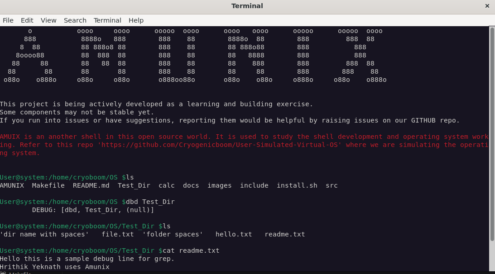

```
        .o.       ooo        ooooo ooooo     ooo  oooo        oooo  ooooo ooooooo  ooooo
       .888.      `88.       .888' `888'     `8'   `88         88   `888`  `8888    d8'
      .8\"888.     888b     d'888   888       8     888b       88    888     Y888..8P
     .8' `888.     8 Y88. .P  888   888       8     8 Y88.     88    888      `8888'
    .88ooo8888.    8  `888'   888   888       8     8  `888'   88    888     .8PY888.
   .8'     `888.   8    Y     888   `88.    .8'     8    Y888 .88    888     d8'  `888b
  o88o     o8888o o8o        o888o    `YbodP'      o8o      88888o  o888o oo888o  o88888o 
```

###### Yes this ASCII title was way harder than making the Shell.

--- 

### Another open shell in this open source world. A hobby project of mine.
<br>

<p> 
I used to procrastinate learning C, it was boring watching tutorials, reading manuels i don't understand the content, i wanted a reason to learn, and that's why i decided to get my hands dirty. But why shell? Because shell is an interface that provides utilities to interact with the OS directly. You might wonder what actually happens when you type your commands on screen, how does it detect keyboard input, how does it know where to output? How can you detect an up arrow key when your command registers input with enter key ?

That's how AMUNIX can help you too study "how a shell operates at base level". AMUNIX is your tool, study it if you want to understand what happens between your keypress and OS. 
To learn about the working and internal structure you can refer to [Architecture.md](https://github.com/Cryogenicboom/Amunix/blob/main/ARCHITECTURE.md) 
</p>

<br>

## What is Shell?
<p>
Shell is a CLI (Command Line Interface) that acts as an interface for an Operating System. Shell enables user to interact with kernal. it provides user with commands, execute programmes for them and manages Input and Output functionality. 
</p>

## Why AMUNIX? 
<p>
I know there exist professional shells already. I built AMUNIX as a curiosity driven project. I was studying   [OSTEP]("https://pages.cs.wisc.edu/~remzi/OSTEP/"), this book ignited the spark in me to understand computers at fundamentals. I thought "why not learn by doing?". I hope that this shell will also help other curious minds to understand the shell development. 
</p>

> use [Valgrind](https://valgrind.org/) to debug and check for mem leaks.


## Installing the shell
1. clone the shell 
> git clone https://github.com/Cryogenicboom/Amunix.git
> <br>
> cd Amunix

2. downlaod the dependencies 
> chmod +x install.sh
> <br>
> ./install.sh

3.  Compile and run
> make all 
> <br>
> make run

## Run Time images 

<br>


<br>


<br>


## See detailed documentation here:  

[Basic Architecture](ARCHITECTURE.md)
<br>


## Command List for AMUNIX ( still adding )
<br>

### BUILT IN COMMANDS: 
| Command         | Syntax                     | Description |
|-----------------|----------------------------|-------------|
| directory badlo | `dbd <directory>`          | Changes the current working directory using `chdir()` system call |
| bahar           | `bahar`                    | Exits the shell program using `exit()` |
| Greet shell     | `Hello`                    | Greet the shell, it's a good habit     |
| who are you?    | `whoru`                    | Sometimes you want to make shell feel known |
| History         | `up arrow key / down arrow key` | prints the previous commands executed |

### SYSTEM COMMAND
| Feature            | Syntax Example              | Description |
|-------------------|----------------------------|-------------|
| External Commands | `ls -l`, `pwd`, `echo hi`  | Executed using `fork()` + `execvp()`  |
| ls color coded    | `ls --color=auto`          | gives out ls output color coded       |
| Argument Passing  | `ls -l /home`              | Arguments are passed as `char* argv[]` to `execvp()` |
| Process Handling  | (implicit)                 | Parent waits for child using `wait()` after execution |
| background process| `sleep 5 &`                | `&` at end of input send command to background        |

### PARSING FEATURES
| Feature                  | Syntax Example              | Description |
|--------------------------|----------------------------|-------------|
| Pipe Separation          | `ls \| grep txt`            | Commands are split into multiple arrays using `\|` :contentReference[oaicite:1]{index=1} |
| Command Count Tracking   | (internal)                 | Counts number of piped commands for execution logic |
| Argument Structuring     | (internal)                 | Stores commands as `commands[10][50]` (2D array) |
| > (Overwrite Output)     | `ls > file.txt`            | Sends standard output to a file, creating it if it doesn't exist or overwriting existing content.|
| < (Input Redirection)    |  `wc -l << file.txt`       | Reads input for a command from a file instead of the keyboard.|

### TOKENIZATION FEATURES
| Feature                | Syntax Example              | Description |
|------------------------|----------------------------|-------------|
| Lexical analysis       | `ls -l` --> {'ls', '-l'}   | Input is split into multiple tokens w.r.t delimeters defined |
| Quote Handling         | `"My Folder"`              | Multi-word-spaced arguments handled using custom parser |
| Null Termination       | (internal)                 | Arrays end with `NULL` for compatibility with `execvp()` |

### LIMITATIONS
| Limitation            | Current status      |
|----------------------|----------------------|
| Append               | Not implemented `>>` |
| fg and bg Job control| in development       |
| strtok() tokenization| removed, manuallt tokenizing now |
