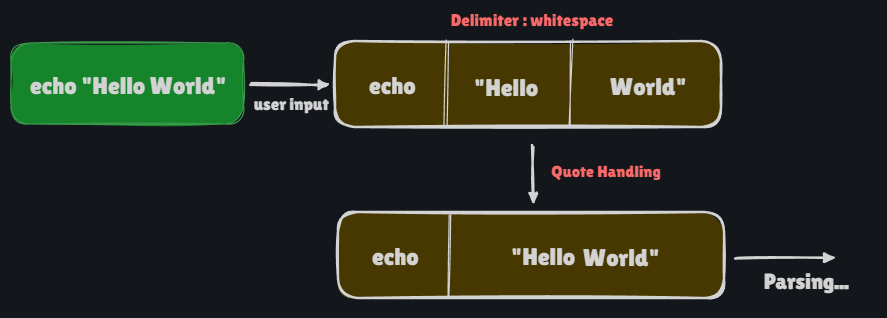
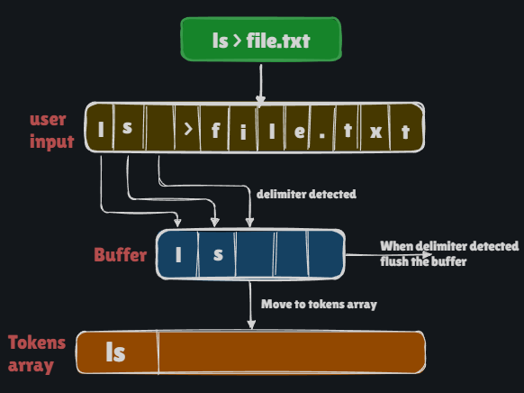

# PART 1 : Lexical Analysis
 

Before we begin, it is suggested to read about lexical analysis [here](https://en.wikipedia.org/wiki/Lexical_analysis).
 

### 1.0 : Prerequisites [ main.c / int main() ]
- if you look up `tokenize()` function in tokenizer.c, 
> void tokenize(char *user_input, char * tok_cmds[])
it takes 2 arguments, a user input and an empty array to store the tokens.

- Before we move ahead, we need to format our user inputted commands. There is a rule that a command must adhere to get entry into tokenizing. __Each command must end with a null terminator `\0`. This helps us know if a command has end or not.__

- [Delimiter](https://en.wikipedia.org/wiki/Delimiter) is one or more characters that separate text strings. These are used to separate tokens. Common delimiters are commas (,), semicolon (;), quotes ( ", ' ), pipes (|), whitespace ( ) or tab space (\t).

 

did you see in above image, we know that quoted content must be together, not to be separated, that's why we need to handle it manually. That's why you can find the following function in `parser.c` 
 

> void parser_for_quotes(char * cmds[], char * parsed_cmds[])\

But that's in Part 3 so we will not worry for it, for now.

### 1.1 Tokens [ parser/tokenizer.c / void tokenize() ]
- Main logic is to traverse the `user input` array and copy it into another array called `tok_cmds` unless we hit a delimiter.
- Your job is to write a loop that trace `user input` array character by character and once it hits the delimiter, it saves all the content before delimiter as a single token and continue tracing.
- Delimiter you should check for : `whitespace`, `tab space`, `pipe`, `file redirections`. 

